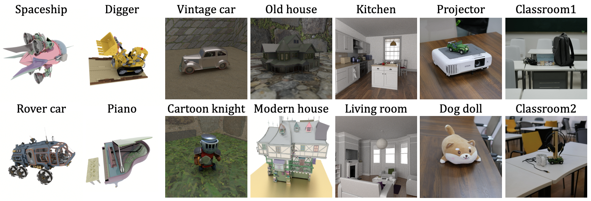

# SpectralNeRF: Physically Based Spectral Rendering with Neural Radiance Field
This is the Pytorch implementation of our AAAI 2024 paper SpectralNeRF.

## Dependencies

* Pytorch
* Other requirements please refer to requirements.txt.

## Data Preparation

The datasets can be downloaded [here](https://drive.google.com/).

Some examples:

The detailed render configurations for **synthetic datasets** and the capture instructions for **real-world scenes** can be found [here](./datasets/dataset.md).

## Results

[Link](https://htmlpreview.github.io/?https://github.com/liru0126/SpectralNeRF/blob/main/supp_videos/index.html)
              

## Acknowledgments

In this project we use (parts of) the implementations of the following work:

* [nerf-pytorch](https://github.com/yenchenlin/nerf-pytorch)

We thank the respective authors for open sourcing of their implementations.
