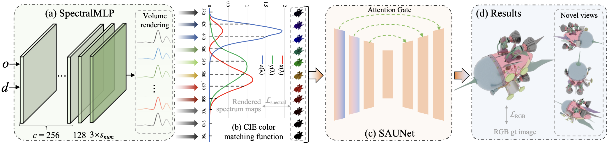

# SpectralNeRF: Physically Based Spectral Rendering with Neural Radiance Field
This is the Pytorch implementation of our AAAI 2024 paper SpectralNeRF.



## Dependencies

* Python
* Pytorch
* Other requirements please refer to requirements.txt.

## Data Preparation

The datasets can be downloaded [here](https://drive.google.com/).

The dataset contains the synthetics datasets and real-world datasets

### Synthetic datasets


### Real-world datasets


## Pre-trained models

The pre-trained models can be downloaded [here](https://drive.google.com/).

## Training
``` 
python3 train.py
```

## Testing

```
python3 test.py
```

## Results

[HTML]()
              

## Acknowledgments

In this project we use (parts of) the implementations of the following work:

* [nerf-pytorch](https://github.com/yenchenlin/nerf-pytorch)

We thank the respective authors for open sourcing of their implementations.
