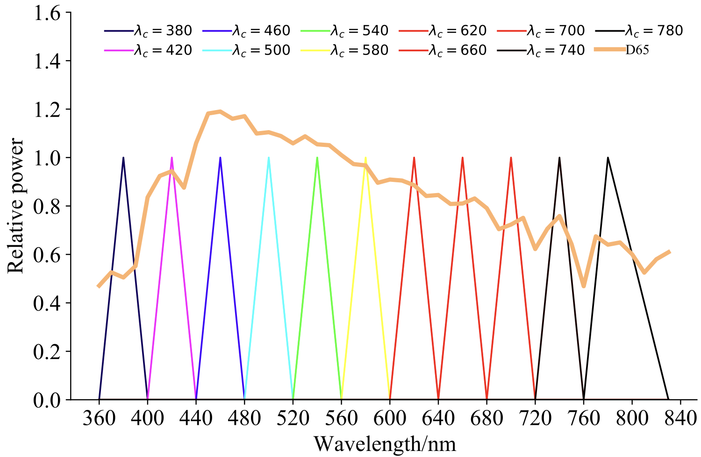

## Synthetic datasets

We render our synthetic scenes with multiple spectral illuminants to generate spectral images. To acquire spectral illuminants, we divide the wavelength range of the light source spectrum in [Mitsuba](https://www.mitsuba-renderer.org/) from 360nm to 830nm into 11 adjacent intervals.

As for the first 10 spectral intervals, the relative power at the midpoint is set to a certain value. The maximum power of the last interval (760nm to 830nm) is set on 780nm because 780nm is a commonly used termination value of visible light. Simultaneously, the power of two endpoints for each interval is set to 0. After a simple linear interpolation, we obtain 11 curves as the spectral power distributions of the spectral illuminants.

In addition, we use the CIE standard illuminant D65 as the default white light source for scenes in our dataset. The D65 light source is an artificial light source that simulates daylight, and its emission spectrum conforms to the average midday light of European and Pacific countries. 

# The Spectral Reflectance and the Camera Response

When rendering the spectral datasets, some materials are assigned with the generated random spectral responses and the bidirectional scattering distribution function (BSDF) of the plastics and the metals. Other materials are physically-based rendering image textures and assigned with plausible smooth spectral responses corresponding to each color using spectral upsampling algorithms in Mitsuba. 

The camera sensor response is fixed as the normal RGB sensitivity curves. The measured spectral power distributions are converted to the linear RGB values based on the CIE 1931 XYZ color matching curves. 

Then, the spectrum maps of multiple wavelengths are rendered by ray-tracing rendering algorithms in Mitsuba

## Real-world datasets

We utilize a camera and 8 color absorbers whose center wavelengths range from 400nm to 750nm with the interval of 50nm to capture the real-world scene. Different color absorbers are covered to the camera lens to obtain the spectral images.
